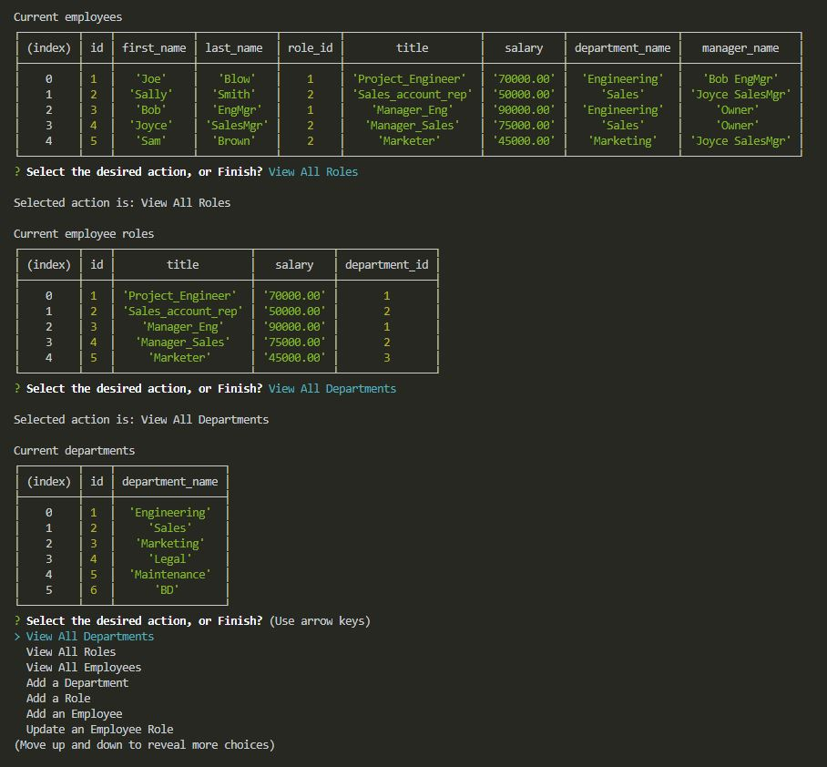

# Employee-Tracker

Richard Ay, October 2020

## Table of Contents
* [Project Objective](#project-objective)
* [Acceptance Criteria](#acceptance-criteria)
* [Technologies Used](#technologies-used)
* [Employee Tracker Logic](#employee-tracker-logic)
* [Application Screen Shot](#application-screen-shot)

## Project Objective
As A business owner I want to be able to view and manage the departments, roles, and employees in my company
so that I can organize and plan my business.

## Acceptance Criteria
Given a command-line application that accepts user input

1) When I start the application then I am presented with the following options: view all departments, view all roles, view all employees, add a department, add a role, add an employee, and update an employee role.

2) When I choose to view all departments then I am presented with a formatted table showing department names and department ids.

3) When I choose to view all roles then I am presented with the job title, role id, the department that role belongs to, and the salary for that role.

4) When I choose to view all employees then I am presented with a formatted table showing employee data, including employee ids, first names, last names, job titles, departments, salaries, and managers that the employees report to.

5) When I choose to add a department then I am prompted to enter the name of the department and that department is added to the database.

6) When I choose to add a role then I am prompted to enter the name, salary, and department for the role and that role is added to the database.

7) When I choose to add an employee then I am prompted to enter the employee’s first name, last name, role, and manager and that employee is added to the database.

8) When I choose to update an employee role then I am prompted to select an employee to update and their new role and this information is updated in the database.

## Technologies Used
* The NPM package inquirer.
* The NPM package mysql2.

## Note-Taker Logic

## Application Screen Shot
